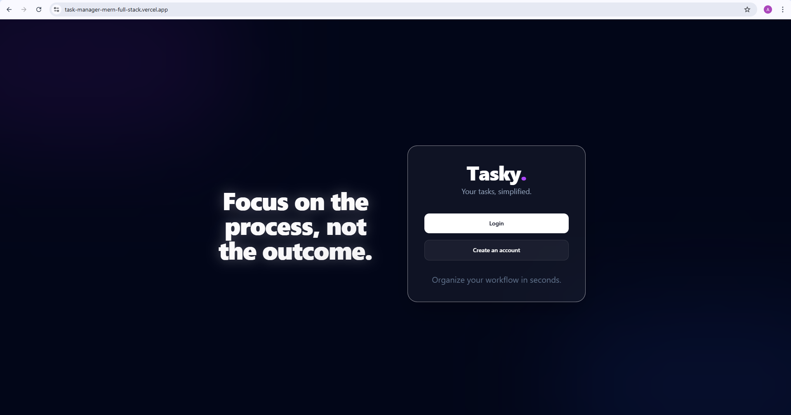
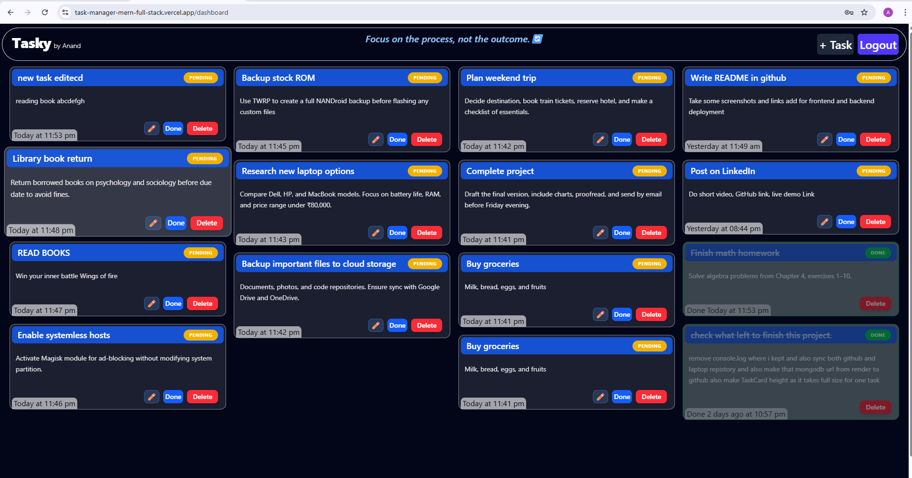
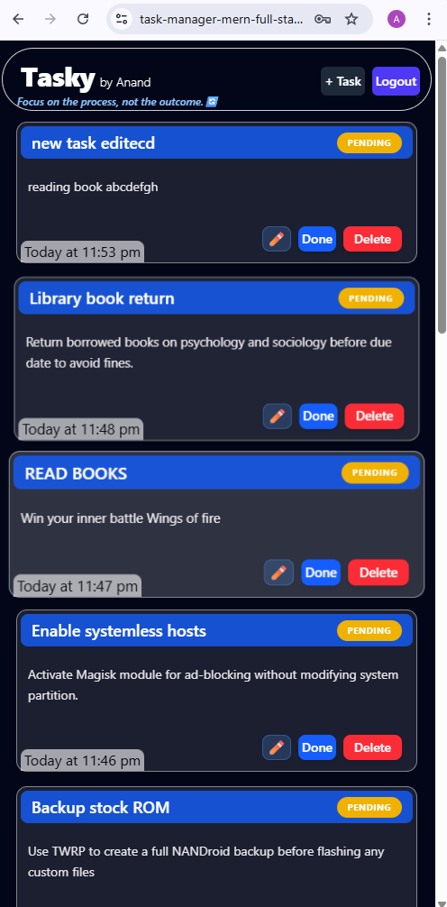

# <p align="center">Tasky</p>

<p align="center">
  
</p>
<p align="center">
  <b>My personal MERN task manager built from scratch, with real debugging, real learning, and real late-night effort.</b>
</p>

***

## About Tasky

Tasky is my **first complete full-stack MERN app**, built for my own daily use and to push my MERN skills to a proper level. I made it without following any tutorial line by line, and most of the code was hand-typed by me while balancing college classes and project work for almost two weeks. AI helped me as a guide when I was stuck, but the logic, structure, debugging, and final build were all done by me.

This project is not one of those copy-paste clones. It is a real personal project with authentication, task management, reminders, email flow, deployment, and production debugging that taught me a lot.

***

## Live Demo
Check here :
- **Frontend:** [Tasky on Vercel](https://task-manager-mern-full-stack.vercel.app/)
- **Backend:** [Tasky API on Render](https://taskmanager-mern-fullstack.onrender.com)


***

## Features

- **First complete MERN build**: My first full-stack app with MongoDB, Express, React, Node.js, and Tailwind CSS.
- **Glassmorphism UI**: Clean blurred cards, soft transparency, and modern-looking layouts.
- **JWT Authentication**: Login and signup are secure and private.
- **Task Scheduling**: Add date and time properly so tasks stay organised.
- **Motivation Engine**: Quote API integration to keep the user going while working.
- **Smart Toasts**: Clear success and error messages for every important action.
- **AI-guided structure**: I used AI to help me plan folder structure and debug, but the code was written by me.
- **Real deployment ready**: Frontend on Vercel and backend on Render.
- **Built for personal use**: It was made to help me manage my own life, not just to impress.

***

## Tech Stack

| Layer | Tools |
| :-- | :-- |
| Frontend | React, Vite, Tailwind CSS |
| Backend | Node.js, Express.js |
| Database | MongoDB Atlas |
| Authentication | JWT |
| Email Service | Brevo API, Axios |
| Deployment | Vercel, Render |
| UI Feedback | Toast notifications |
| Styling | Glassmorphism, animations |


***

## Folder Structure

```bash
TaskManager/
├── backend/
│   ├── Controller/
│   │   ├── authcontroller.js
│   │   └── taskcontroller.js
│   ├── app.js
│   ├── middlewares/
│   │   └── authMiddleware.js
│   ├── models/
│   │   ├── Tasks.js
│   │   └── Users.js
│   ├── package-lock.json
│   ├── package.json
│   ├── routes/
│   │   └── taskRoutes.js
│   └── utils/
│       ├── resetPassword.js
│       └── sendEmail.js
├── frontend/
│   ├── src/
│   │   ├── api/
│   │   │   └── axiosInstance.js
│   │   ├── components/
│   │   │   ├── AddTask.jsx
│   │   │   ├── ConfirmModal.jsx
│   │   │   ├── EditTaskModal.jsx
│   │   │   ├── NavBar.jsx
│   │   │   ├── PageLoader.jsx
│   │   │   ├── Quote.jsx
│   │   │   └── TaskCard.jsx
│   │   ├── pages/
│   │   │   ├── Dashboard.jsx
│   │   │   ├── IntroPage.jsx
│   │   │   ├── Login.jsx
│   │   │   ├── Register.jsx
│   │   │   └── passwordResetPage.jsx
│   │   └── services/
│   │       ├── authService.jsx
│   │       └── taskServices.jsx
│   └── vite.config.js
└── structure.txt
```


***

## Installation

### 1. Clone the repo

```bash
git clone https://github.com/anandgonaboyina/TaskManager_MERN_FullStack.git
cd tasky
```


### 2. Install backend dependencies

```bash
cd backend
npm install
```


### 3. Install frontend dependencies

```bash
cd ../frontend
npm install
```


### 4. Create `.env` file in backend

```env
MONGO_URI=your_mongodb_atlas_uri
JWT_SECRET=your_jwt_secret
BREVO_API_KEY=your_brevo_api_key
EMAIL_USER=your_verified_email
```


### 5. Run backend

```bash
cd backend
npm start
```


### 6. Run frontend

```bash
cd frontend
npm run dev
```


***

## API Endpoints

> These are the main endpoints used in Tasky. Adjust names if your final route prefixes are slightly different.


| Method | Endpoint | Purpose |
| :-- | :-- | :-- |
| POST | `/api/auth/register` | Register new user |
| POST | `/api/auth/login` | Login user |
| POST | `/api/auth/forgot-password` | Send reset email |
| POST | `/api/auth/reset-password/:token` | Reset password |
| GET | `/api/tasks` | Get all tasks |
| POST | `/api/tasks` | Create task |
| PUT | `/api/tasks/update/:id` | Update task |
| DELETE | `/api/tasks/delete/:id` | Delete task |
| GET | `/api/quote` | Get motivational quote |


***

## The Real Challenges

### The CORS Battle

Connecting Vercel frontend to Render backend was one of the first serious problems I faced. The app kept failing because of preflight requests, `withCredentials`, and origin mismatch issues. I fixed it by handling the origin dynamically on the backend and making sure credentials were configured properly on both frontend and backend.

### Vercel Refresh 404

When I refreshed a page on Vercel, it kept showing 404 because React routes were not being handled correctly. I solved it by adding a `vercel.json` rewrite rule so all routes redirect properly to `index.html`. This was a small file, but it saved the whole app.

### SMTP vs API

I first used Nodemailer for email, but Render blocks SMTP ports on the free tier, so the mail system could not work properly. After wasting time trying different things, I switched to the Brevo API with Axios. That change took effort, but it finally made the password reset flow reliable.

### Mixed Content

My Quote API requests were getting blocked because the frontend was on HTTPS while the quote endpoint was on HTTP. The browser blocked it as mixed content. I fixed it by switching to an HTTPS-safe source, which removed the security error.

***

## What I Learned

This was my first full-stack project, so I had to learn a lot on the way. I learned how to structure files properly, keep backend and frontend clean, and deal with real deployment problems instead of just local development. It also showed me that building from scratch is hard, but it is the best way to actually understand the stack.

I spent hours debugging these issues while attending college classes, and that made the final result feel earned. It was not polished from the start, but that is exactly why this project means a lot to me.

***

## Screenshots Section

### Dashboard layout

<p align="center">
  
</p>

### Mobile Dashboard layout
<p align="center">
  
</p>

***


## Credits

Built by me as a personal project, with AI support used only as a guide for structure, debugging, and improvement. The actual building, typing, fixing, and deployment were done by me.

***

